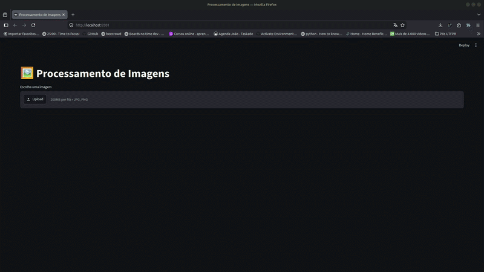
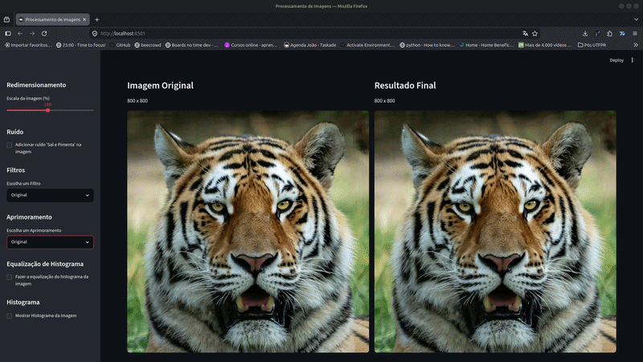
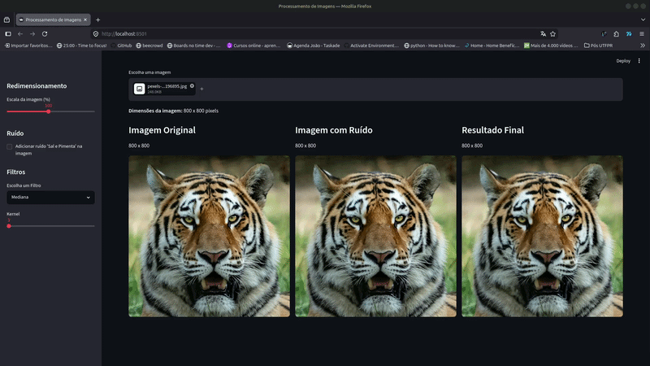

# 🖼️ Filtros de Imagens com OpenCV e Streamlit

Projeto desenvolvido para estudo de **Processamento Digital de Imagens** utilizando **Python**, **OpenCV** e **Streamlit**.

A aplicação permite carregar uma imagem, aplicar diferentes técnicas de processamento e visualizar o resultado em tempo real através de uma interface web simples e intuitiva.

---

## 📸 Funcionalidades

- Upload de imagens (.jpg, .jpeg e .png)
- Redimensionamento da imagem
- Conversão para escala de cinza
- Adição de ruído Sal e Pimenta
- Aplicação dos seguintes filtros:
  - Filtro da Média
  - Filtro Gaussiano
  - Filtro da Mediana
  - Filtro de Sobel
  - Filtro Laplaciano
  - Filtro High Boost
- Comparação entre imagem original e imagem processada









---

## 🛠️ Tecnologias utilizadas

- Python 3.10+
- OpenCV
- NumPy
- Streamlit

---

## 📂 Estrutura do projeto

```text
filtrosImagens/
│
├── images/					# Pasta com imagens
├── main.py                 # Inicialização da aplicação
├── streamlit_app.py        # Interface gráfica
├── image_processing.py     # Implementação dos filtros
├── requirements.txt
├── README.md
└── .gitignore
```

---

## ▶️ Como executar

### 1. Clone o repositório

```bash
git clone https://github.com/Joao-gui/filtrosImagens.git
cd filtrosImagens
```

### 2. Crie um ambiente virtual

Utilizando Conda:

```bash
conda create -n filtros-imagens python=3.10
conda activate filtros-imagens
```

ou

```bash
conda create --prefix ./conda python=3.10
conda activate ./conda
```

### 3. Instale as dependências

```bash
pip install -r requirements.txt
```

### 4. Execute a aplicação

```bash
streamlit run main.py
```

Após iniciar, acesse:

```
http://localhost:8501
```

---

## 📚 Filtros implementados

### Escala de Cinza

Converte uma imagem RGB para tons de cinza.

### Filtro da Média

Realiza a suavização através da média dos pixels vizinhos.

### Filtro Gaussiano

Aplica uma suavização ponderada utilizando uma distribuição Gaussiana.

### Filtro da Mediana

Remove ruídos do tipo **Sal e Pimenta**, preservando melhor as bordas da imagem.

### Sobel

Realiza a detecção de bordas utilizando os gradientes horizontal e vertical.

### Laplaciano

Realiza a detecção de bordas através da segunda derivada da imagem.

### High Boost

Realça detalhes da imagem preservando suas características originais.

---

## 📖 Objetivo

Este projeto foi desenvolvido com o objetivo de praticar conceitos de:

- Processamento Digital de Imagens
- Visão Computacional
- OpenCV
- Manipulação de imagens utilizando NumPy
- Desenvolvimento de interfaces com Streamlit

---

# 👨‍💻 Autor

João Guilherme Pellacani

Engenheiro Eletricista • Pós-graduando em Inteligência Artificial (UTFPR)

GitHub: https://github.com/Joao-gui
