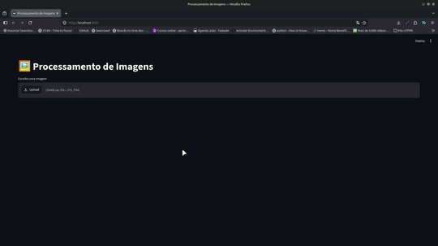

# 🖼️ Filtros de Imagens com OpenCV e Streamlit

Projeto desenvolvido para estudo de **Processamento Digital de Imagens** utilizando **Python**, **OpenCV** e **Streamlit**.

A aplicação permite carregar uma imagem, aplicar diferentes técnicas de processamento e visualizar o resultado em tempo real através de uma interface web simples e intuitiva.

---

## 📸 Funcionalidades

- Upload de imagens (.jpg, .jpeg e .png)
- Redimensionamento da imagem
- Adição de ruído "Sal e Pimenta"
- Aplicação dos seguintes filtros:

  - Conversão para escala de cinza
  - Filtro da Média
  - Filtro Gaussiano
  - Filtro da Mediana
  - Filtro de Sobel
  - Filtro Laplaciano
  - Filtro High Boost
- Aplicação de Aprimoramento

  - Negativo
  - Transformação Logarítmica
  - Transformação Gama
  - Ajuste de Contraste
- Segmentação

  - Limiarização (Thresholding)
  - Limiarização (Método Otsu)
  - Segmentação por Cor (HSV)
  - Detecção de bordas (Canny)
  - Watershed
- Equalização de Histograma
- Histograma
- Comparação entre imagem original e imagem processada




---

## 🛠️ Tecnologias utilizadas

- Python 3.10+
- OpenCV
- NumPy
- Streamlit

---

## 📂 Estrutura do projeto

```text
filtrosImagens/
│
├── images/					# Pasta com imagens
├── utils/					# Pasta com os scripts
│	└── streamlit_app.py    # Interface gráfica
│	└── image_processing.py # Implementação dos filtros
│	└── aprimoramento.py    # Implementação dos aprimoramentos da imagem
│	└── segmeentacao.py		# Implementação de segmentação da imagem
├── main.py                 # Inicialização da aplicação
├── README_images/			# Pasta com os arquivos .gif do README
├── LICENSE.md
├── requirements.txt
├── README.md
└── .gitignore
```

---

## ▶️ Como executar

### 1. Clone o repositório

```bash
git clone https://github.com/Joao-gui/filtrosImagens.git
cd filtrosImagens
```

### 2. Crie um ambiente virtual

Utilizando Conda:

```bash
conda create -n filtros-imagens python=3.10
conda activate filtros-imagens
```

ou

```bash
conda create --prefix ./conda python=3.10
conda activate ./conda
```

### 3. Instale as dependências

```bash
pip install -r requirements.txt
```

### 4. Execute a aplicação

```bash
streamlit run main.py
```

Após iniciar, acesse:

```
http://localhost:8501
```

---

## 📏 Redimensionamento

Muda a escala da imagem (%).

---

## 🧂 Ruído

Adiciona a imagem o ruído 'Sal e Pimenta'.

---

## 📚 Filtros implementados

### Escala de Cinza

Converte uma imagem RGB para tons de cinza.

### Filtro da Média

Realiza a suavização através da média dos pixels vizinhos.

### Filtro Gaussiano

Aplica uma suavização ponderada utilizando uma distribuição Gaussiana.

### Filtro da Mediana

Remove ruídos do tipo **Sal e Pimenta**, preservando melhor as bordas da imagem.

### Sobel

Realiza a detecção de bordas utilizando os gradientes horizontal e vertical.

### Laplaciano

Realiza a detecção de bordas através da segunda derivada da imagem.

### High Boost

Realça detalhes da imagem preservando suas características originais.

---

## 🔧 Aprimoramentos Implementados

### Negativo

Transforma uma imagem em escala de cinza com 256 níveis de intensiadde

### Transforamção Logarítmica

Função de transformação de intesidade não-linear útil para manipulação de contraste.

### Transformação Gama

Função de transformação de intensidade não-linear. Assim como a logarítmica, manipula-se o contraste.

### Ajuste de Contraste

Ajuste de contraste permite espalha ou comprimir a distribuição do histograma de uma imagem, aumentando ou diminuindo o contraste da iamgem, através da transformação de intensidade linear.

---

## 🎨 Segmentação

### Limiarização (Thresholding)

A limiarização divide a imagem em regiões de acordo com o valor de intensidade de cada pixel em comparação com um limiar.

O valor do limiar pode ser obtido empiricamente através de várias tentativas com diferentes valores para o limiar até a obtenção de um resultado satisfatório.

O valor do limiar também pode ser obtido através da análise do histograma. Se o histograma da imagem apresenta dois picos, pode-se escolher como valor de limiar um nível de cinza que se encontra no vale entre esses dois picos do histograma.

### Limizarização (Método Otsu)

Este método calcula automaticamente o valor do limiar a partir do histograma da imagem de entrada.

### Segmentação por Cor (HSV)

Aplica a segmentação a partir de uma cor específica.

### Detecção de bordas (Canny)

É um dos principais métodos de detecção de bordas por permitir a detecção de bordas em toda a imagem, incluindo regiões de baixo contraste. É um dos principais métodos de detecção de bordas por permitir a detecção de bordas em toda a imagem, incluindo regiões de baixo contraste.

### Watershed

É um algoritmo de segmentação de imagem em que os objetos de interesse são bem distintos uns dos outros, mas esses objetos estão conectados entre si.

---

## 📈 Equalização de Histograma

Permite reduzir as diferenças de intensidade em uma imagem aproximando o histograma da imagem de entrada de um histograma uniforme.

---

## 📊 Histograma

O histograma de uma imagem apresenta a distribuição dos níveis de intensidade dos pixels da imagem.

---

## 📖 Objetivo

Este projeto foi desenvolvido com o objetivo de praticar conceitos de:

- Processamento Digital de Imagens
- Visão Computacional
- OpenCV
- Manipulação de imagens utilizando NumPy
- Desenvolvimento de interfaces com Streamlit

---

# 👨‍💻 Autor

João Guilherme Pellacani

Engenheiro Eletricista • Pós-graduando em Inteligência Artificial (UTFPR)

GitHub: https://github.com/Joao-gui
